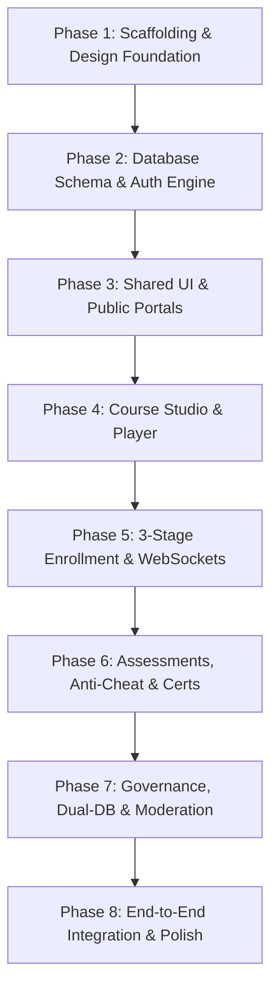

# ESMMS — Enterprise Master Technical Implementation Plan
## Complete Step-by-Step Engineering Blueprint by Phases

---

## Executive Summary

This document defines the **8-Phase Engineering & Implementation Plan** to construct the complete **Enterprise Secure Module Management System (ESMMS)**. Every phase includes its exact architectural goals, backend services, frontend components, state machines, security protocols, API routes, and verification checklists.

---

## Phase Breakdown & Architecture Overview



---

## Phase 1: Environment Scaffolding, Backend Server & Dual-Theme UI Setup

### 1.1 Objectives
Establish the full monorepo foundation, backend HTTP/WebSocket servers with enterprise security middleware, and frontend client with the exact Tailwind design token system (Navy `#172A46` sidebar and Charcoal `#101212` dark surfaces).

### 1.2 Backend Implementation
1. **Server Core (`/server`)**:
   - `server.ts`: Express application initialization with HTTP and Socket.io server attachment.
   - `helmet` security headers configuration (CSP, X-Frame-Options, HSTS).
   - `cors` with credentials support (`origin: http://localhost:5173`).
   - `express-rate-limit` (Global: 100 req / 15 min; Auth: 5 req / 15 min).
   - `xss` payload sanitization middleware.
   - `cookie-parser` for signed `HttpOnly` refresh token cookies.
   - `winston` structured logger with error and combined file streams + console output.
2. **Health Check Endpoints**:
   - `GET /api/v1/health` &mdash; Returns server uptime, memory usage, and timestamp.

### 1.3 Frontend Implementation
1. **Client Core (`/client`)**:
   - React 19 + Vite 8 initialization.
   - Tailwind CSS configuration (`tailwind.config.js`) containing:
     - Sidebar Navy: `#172A46`, hover `#1E3A5F`, active `#244670`, border `#26405F`.
     - Dark background: `#101212`, card `#1C1F1F`, elevated `#232626`, border `#303333`.
     - Brand Blue: `#2563EB` (600), `#3B82F6` (500).
   - Base typography set to Google Fonts *Inter*.
   - Global stylesheet (`index.css`) with smooth theme transitions and custom thin scrollbars.
2. **Core Contexts**:
   - `ThemeContext.tsx`: Dark/Light class switcher with `localStorage` persistence.
   - `AxiosInstance.ts`: Pre-configured HTTP client with base URL `/api/v1` and credentials.

### 1.4 Verification & Acceptance Criteria
- [ ] Backend starts on port 5000 with clean Winston log output.
- [ ] Frontend Vite dev server loads on port 5173 with hot module replacement.
- [ ] Health check endpoint returns `200 OK`.
- [ ] Theme toggles between Light and Neutral Dark mode without visual glitches.

---

## Phase 2: Database Layer, Seed Data & Complete Authentication Engine

### 2.1 Objectives
Deploy all 11 Prisma ORM entities, dual-token JWT authentication with HttpOnly cookie rotation, brute-force protection, 2FA OTP generation, and seed initial demo accounts.

### 2.2 Database & Prisma Models
1. Deploy 11 Models in `schema.prisma`:
   - `User` (Identity, roles: `ADMIN`, `MODERATOR`, `COURSE_CREATOR`, `USER`, status, failed attempts, lockUntil, 2FA OTP fields).
   - `Module` (Courses with `expiresAt` platform expiration timestamp).
   - `Section` & `Lesson` (Multi-modal lesson structure).
   - `Assignment` (Student course progress, due date, extension fields, completed lessons JSON, last active state).
   - `CourseEnrollmentRequest` (3-stage status: `PENDING_CREATOR`, `FORWARDED_TO_ADMIN`, `APPROVED`, `REJECTED`).
   - `ActiveSession` (Dual-token SHA-256 refresh token tracking).
   - `Notification` (Live in-app alerts).
   - `AuditLog` (Immutable security audit trail with risk classification).
   - `Assessment` & `AssessmentSubmission` (Question pool, passing score %, answers, auto-grading).
   - `Certificate` (Tamper-proof cryptographic certificates with SHA-256 hashes).
2. **Database Seeding (`prisma/seed.ts`)**:
   - Admin: **Sarah Chen** (`sarah.chen@qualiva.io`, password: `Password123!`, dept: `Administration`).
   - Creator: **James Mitchell** (`james.mitchell@qualiva.io`, password: `Password123!`, dept: `Engineering`).
   - Moderator: **Marcus Johnson** (`marcus.johnson@qualiva.io`, password: `Password123!`, dept: `Operations`).
   - Student: **David Kim** (`david.kim@qualiva.io`, password: `Password123!`, dept: `Engineering`).
   - Sample published courses, sections, lessons, and questions.

### 2.3 Security & Authentication Logic
1. **Dual-Token Lifecycle (`auth.controller.ts`)**:
   - Access Token: 15-minute lifetime, payload `{ sub, email, role, status }`.
   - Refresh Token: 7-day lifetime, stored in secure, `HttpOnly`, `SameSite=Lax` cookie.
   - Rotation: `POST /api/v1/auth/refresh` invalidates previous `refreshTokenHash` in `ActiveSession` and issues a fresh pair.
2. **Brute-Force Account Protection**:
   - On failed password: increment `failedLoginAttempts`.
   - If `failedLoginAttempts >= 5`: set `status = 'LOCKED'` and `lockUntil = now + 15 min`.
   - On valid login: reset `failedLoginAttempts = 0`.
3. **2FA OTP Engine (`nodemailer` + `crypto`)**:
   - Cryptographic 6-digit OTP generation (`crypto.randomInt(100000, 999999)`).
   - SHA-256 hashed in database with 10-minute expiry; dispatched via SMTP.
4. **Auth Context & Interceptors (`AuthContext.tsx`)**:
   - Automatic silent token refresh via Axios response interceptor on `401 Unauthorized`.
   - Instant 1-click Demo Account login helpers.

### 2.4 Verification & Acceptance Criteria
- [ ] Database migrated and seeded with zero errors.
- [ ] Login generates valid 15-min JWT and sets `HttpOnly` refresh cookie.
- [ ] Refresh endpoint successfully rotates tokens and revokes old sessions.
- [ ] 5 consecutive bad passwords lock account for exactly 15 minutes.
- [ ] 2FA OTP validates correctly.

---

## Phase 3: Shared UI Components, Navigation Shell & Public Portals

### 3.1 Objectives
Build the complete design system component library, responsive `AppShell` with role-scoped navigation, and all public-facing pages (Landing, Login, Registration Wizard, Certificate Verification, 404).

### 3.2 UI Component System (`/client/src/components`)
1. **Primitives (`/ui`)**:
   - `Button`: Primary, Secondary, Outline, Ghost, Danger variants with loading spinners.
   - `Input` & `Textarea`: Labeled inputs with error states and helper hints.
   - `Select`: Accessible dropdown selector.
   - `Modal` & `Drawer`: Accessible animated overlays with focus trapping and ESC-dismissal.
   - `Table`: Responsive data table with header sorting and empty states.
   - `Tabs`: Tabbed container with active indicator and count badges.
   - `Toast`: Global notification toast system with success, error, warning, and info styles.
2. **Domain Components (`/shared`)**:
   - `StatusBadge`: 20+ status styles with dot indicators.
   - `Avatar`: Initials/Image avatar with size variants.
   - `Progress`: Percentage progress bar with smooth transitions.
   - `SearchInput`: Search bar with instant clear icon.
   - `PageHeader`: Title, description, and action button container.

### 3.3 Layouts & Public Pages (`/client/src/pages/public`)
1. **`AppShell.tsx`**:
   - Fixed Deep Navy (`#172A46`) Sidebar with role-based navigation links.
   - Top Header with mobile drawer toggle, global search input, theme switcher, notification bell, and user avatar dropdown menu.
2. **Landing Page (`Landing.tsx`)**:
   - Hero section with dual CTAs, 6 platform feature cards, 4-step interactive enrollment roadmap, live audit preview, and footer.
3. **Login Page (`Login.tsx`)**:
   - Authentication form + 1-click demo role selector grid (**Admin**, **Creator**, **Moderator**, **Student**).
4. **Registration Wizard (`Registration.tsx`)**:
   - Step 1: Personal info & department.
   - Step 2: Password with real-time strength bar.
   - Step 3: Account summary and simulated OTP verification.
5. **Certificate Verification (`CertificateVerification.tsx`)**:
   - Public search by Certificate ID (e.g. `QLV-2026-00142`) with real-time verification card.

### 3.4 Verification & Acceptance Criteria
- [ ] All public pages render cleanly across desktop, tablet, and mobile viewports.
- [ ] Demo accounts switch roles seamlessly in the UI.
- [ ] Registration 3-step wizard enforces password strength rules.
- [ ] Public verification displays valid certificates and error states for invalid IDs.

---

## Phase 4: Course Authoring Studio & Multi-Modal Learning Player

### 4.1 Objectives
Build the complete Course Authoring workspace for creators/admins and the distraction-free, sequential learning player for students with playback timestamp memory.

### 4.2 Backend Implementation (`/api/v1/modules`)
1. **Module & Curriculum CRUD**:
   - `POST /api/v1/modules` &mdash; Create module with metadata and `expiresAt` platform expiration date.
   - `GET /api/v1/modules` &mdash; Fetch active modules (filtered by `status: 'ACTIVE'` and `expiresAt > now()`).
   - `GET /api/v1/modules/:id` &mdash; Nested module with sections and lessons.
   - `PUT /api/v1/modules/:id` &mdash; Update course curriculum and order.
2. **Assignment & Progress APIs (`/api/v1/assignments`)**:
   - `PATCH /api/v1/assignments/:id/progress` &mdash; Save completed lesson keys (`["0_0", "0_1"]`), calculate percentage, and record `lastActive` playback timestamp.
   - `POST /api/v1/assignments/:id/extension` &mdash; Submit extension request with justification.

### 4.3 Frontend Implementation
1. **Course Authoring Studio (`CourseStudio.tsx`)**:
   - Top course switcher dropdown.
   - **Details Tab**: Title, code, department, difficulty, duration, description, outcomes list.
   - **Curriculum Tab**: Collapsible section containers, multi-modal lesson cards (Video, YouTube URL, Markdown editor, Document/PDF upload), lesson reordering, add lesson/section modals.
   - **Settings Tab**: Expiration window in months, passing score %, sequential progression toggle.
2. **Course Catalog & Detail (`CourseCatalog.tsx`, `CourseDetail.tsx`)**:
   - Searchable, filterable catalog by department and difficulty.
   - Dynamic CTA (Start Course / Resume Course / Request Enrollment).
   - Syllabus breakdown, FAQs accordion, student reviews.
3. **Distraction-Free Course Player (`CoursePlayer.tsx`)**:
   - Collapsible syllabus sidebar with checkmark completion indicators.
   - **Multi-Modal Content Renderer**:
     - YouTube video player embed.
     - Custom video player container.
     - Rich Markdown document viewer with DOMPurify sanitization.
     - Document / PDF download tile.
   - **Sequential Unlocking**: Previous lesson must be completed before the next unlocks.
   - **Playback Timestamp Memory**: Persists video time every 5 seconds to `localStorage` and `Assignment.lastActive`.
   - Auto-prompt to take Certification Exam upon 100% completion.

### 4.4 Verification & Acceptance Criteria
- [ ] Course creator can create, edit, reorder sections/lessons, and save drafts.
- [ ] Student player correctly renders Video, Markdown, and Document lessons.
- [ ] Sequential locking prevents skipping unfinished lessons.
- [ ] Video playback timestamp resumes accurately after closing and reopening the browser.

---

## Phase 5: 3-Stage Course Enrollment Pipeline & Real-Time WebSockets

### 5.1 Objectives
Implement the complete 3-stage enrollment state machine, bidirectional WebSocket events, live notification toasts, and the student waiting-room auto-redirect.

### 5.2 State Machine & Business Logic
```
[ Student Applies ] ──► [ Stage 1: PENDING_CREATOR ]
                               │
                               ▼ (Creator Endorses)
                        [ Stage 2: FORWARDED_TO_ADMIN ]
                               │
                               ▼ (Admin Approves)
                        [ Stage 3: APPROVED & ACTIVE ]
                        (Assignment Created: Due in 14 Days)
```

1. **Stage 1 — Application (`POST /api/v1/enrollments/request`)**:
   - Creates `CourseEnrollmentRequest` with `status = 'PENDING_CREATOR'`.
   - Emits Socket event `creator_new_request` to room `role_COURSE_CREATOR`.
2. **Stage 2 — Creator Endorsement (`PATCH /api/v1/enrollments/:id/forward`)**:
   - Sets `status = 'FORWARDED_TO_ADMIN'`, records `creatorRecommendation` and timestamp.
   - Emits Socket event `admin_new_request` to room `role_ADMIN`.
3. **Stage 3 — Admin Final Approval (`PATCH /api/v1/enrollments/:id/approve`)**:
   - Sets `status = 'APPROVED'`, records `reviewedByAdminAt`.
   - Creates `Assignment` with `dueDate = now + 14 days`, `progress = 0`, `status = 'ASSIGNED'`.
   - Emits Socket event `enrollment_approved` to student room `user_<studentId>`.

### 5.3 Frontend Implementation
1. **Creator Requests Queue (`CreatorRequests.tsx`)**:
   - List of pending applications with student motivations.
   - Endorsement Modal: Input recommendation notes and trigger forward-to-admin.
2. **Admin Approvals Hub (`AdminApprovals.tsx`)**:
   - Tabbed queue: **Enrollment Requests** vs **Reassignments / Transfer Requests**.
   - Review Modal: Student motivation, creator notes, Approve / Reject buttons with custom admin notes.
3. **Student Live Waiting Screen (`/waiting-approval/course/:id`)**:
   - Live waiting state showing application progress stepper.
   - Socket listener for `enrollment_approved`: Triggers celebratory confetti (`canvas-confetti`) and auto-redirects to `/learn/:id` within 3 seconds.

### 5.4 Verification & Acceptance Criteria
- [ ] Submitting enrollment immediately notifies Creator via WebSocket.
- [ ] Creator endorsement moves request to Admin queue in real time.
- [ ] Admin approval provisions assignment with 14-day due date.
- [ ] Student waiting screen receives socket event, fires confetti, and auto-redirects to player without manual page reload.

---

## Phase 6: Assessment Engine, Anti-Cheat Proctored Exams & Cryptographic Certificates

### 6.1 Objectives
Build the assessment authoring studio, Fisher-Yates question sampling engine, anti-cheat proctored exam player with tab-switching detection, instant auto-grading, and tamper-proof SHA-256 cryptographic certificate generation.

### 6.2 Assessment Engine & Auto-Grading (`/api/v1/assessments`)
1. **Assessment Authoring (`POST /api/v1/assessments`)**:
   - Question pool definition (Multiple Choice, True/False, Short Answer with points and explanations).
   - Passing score threshold (e.g. 80%) and time limit (e.g. 45 mins).
2. **Randomized Question Sampling (`POST /api/v1/assessments/:id/start-session`)**:
   - Fisher-Yates shuffle algorithm draws exactly `sampleSize` questions without duplicates.
3. **Auto-Grading Algorithm (`POST /api/v1/assessments/:id/submit`)**:
   $$\text{Score \%} = \left\lfloor \frac{\text{Correct Count}}{\text{Total Questions}} \times 100 \right\rfloor$$
   $$\text{Passed} = (\text{Score \%} \ge \text{passingScore})$$
   - If `Passed === true`: updates `Assignment.status = 'COMPLETED'`, `progress = 100%`, and issues `Certificate`.

### 6.3 Cryptographic Certificate Engine (`/api/v1/certificates`)
1. **Fingerprint Hash Generation**:
   $$\text{Hash} = \text{SHA256}(\text{userId} + \text{moduleId} + \text{score} + \text{issuedAt} + \text{JWT\_SECRET})$$
   - Stored in `Certificate` model with unique code `ESMMS-CERT-YYYY-XXXXXX`.
2. **PDF Generation (`pdfkit`)**:
   - Vector PDF generation with border motifs, official seal, student name, course title, issue date, and QR code verification link.

### 6.4 Frontend Implementation
1. **Assessment Studio (`AssessmentStudio.tsx`)**:
   - Question bank manager with points and explanations.
   - **PDF Question Bank Importer**: Multi-step wizard to upload PDF, preview extracted questions, and bulk-import into exam.
2. **Proctored Certification Exam (`CertificationExam.tsx`)**:
   - Countdown timer with warning color when $<5$ minutes remaining.
   - Question Palette Navigator (Current, Answered, Bookmarked).
   - **Anti-Cheat Monitoring**: Tracks window `blur` and `document.visibilitychange`; logs warning strikes (1 to 3); auto-submits on 3rd violation.
   - Pass/Fail result screen with immediate certificate unlock.
3. **Certificate Viewer (`CertificatePage.tsx`)**:
   - Formal certificate layout with download PDF, PNG download (`html2canvas`), Print, and QR verification preview.

### 6.5 Verification & Acceptance Criteria
- [ ] Questions randomize properly per session using Fisher-Yates shuffle.
- [ ] Anti-cheat tab switch triggers progressive warning strikes and auto-submits on strike 3.
- [ ] Passing score instantly generates certificate and marks assignment completed.
- [ ] Public verification validates SHA-256 certificate authenticity.

---

## Phase 7: Administration, Bulk Import, Dual-DB Hot Standby & Moderation

### 7.1 Objectives
Build high-speed binary Excel bulk user onboarding, immutable security audit ledger, user lock/unlock lifecycle, dual-database hot-standby replication engine, and the read-only Moderator portal.

### 7.2 Bulk Import & Administration (`/api/v1/users`)
1. **High-Speed XLSX Parser (`xlsx`)**:
   - Streams `.xlsx` / `.csv` files; batches and hashes passwords; imports 50+ users in $<1.5$ seconds.
2. **User Lifecycle & Lockout**:
   - `PATCH /api/v1/users/:id/status` &mdash; Toggle `ACTIVE`, `LOCKED`, `SUSPENDED`.
   - `POST /api/v1/users/:id/reset-password` &mdash; Trigger administrative password reset.
3. **Immutable Audit Ledger (`/api/v1/audit-logs`)**:
   - Records actor, action, resource, IP address, timestamp, and risk classification (Low / Medium / High).

### 7.3 Dual-Database Hot-Standby Engine (`/server/src/services/dbManager.ts`)
1. **Replication Architecture**:
   - Reads: 100% routed to Primary DB (`PRIMARY_DB_URL`).
   - Writes: Synchronous write on Primary + async outbox mutation to Backup DB (`BACKUP_DB_URL`).
   - Exponential backoff retry queue (max 10 attempts, delay: $\min(60000, 1000 \times 2^{\text{attempts}})$).
2. **Delta Catch-Up Sync Algorithm**:
   - Reconciles delta records where `updatedAt > TargetDB.lastSyncTimestamp` before database promotion.

### 7.4 Moderator Portal Implementation (`/client/src/pages/moderator`)
1. **Moderator Dashboard (`ModeratorDashboard.tsx`)**:
   - Operational health metrics: Active users, active courses, open transfers, pending messages.
2. **Read-Only User Directory (`ModeratorUsers.tsx`)**:
   - Searchable user table with progress inspection modal (read-only; no lock/delete controls).
3. **Course Directory & Transfer Monitor (`ModeratorCourses.tsx`, `ModeratorTransfers.tsx`)**:
   - Inspect curriculum content and monitor student course transfer justifications.

### 7.5 Verification & Acceptance Criteria
- [ ] Bulk import successfully ingests 50+ users from an Excel file in $<1.5$s.
- [ ] Admin can lock/unlock users and view security audit logs.
- [ ] Dual-DB engine asynchronously replicates mutations to the backup database.
- [ ] Moderator portal operates strictly in read-only mode.

---

## Phase 8: End-to-End System Verification, Performance Optimization & Polish

### 8.1 Objectives
Conduct full end-to-end integration testing across all 4 user roles, verify real-time event delivery, run load tests, and polish UI interactions.

### 8.2 Testing Matrix

| Scenario | Steps to Execute | Expected Outcome |
| :--- | :--- | :--- |
| **Full Student Lifecycle** | Register $\rightarrow$ Browse Catalog $\rightarrow$ Request Enrollment $\rightarrow$ Wait on Live Screen | Waiting screen receives socket approval, triggers confetti, auto-opens course |
| **Creator & Admin Approvals** | Creator endorses application $\rightarrow$ Admin approves in Approvals Hub | Assignment created with 14-day due date; audit log recorded |
| **Learning & Exam** | Complete sequential lessons $\rightarrow$ Start Exam $\rightarrow$ Trigger tab blur strike | Warning banner appears; passing $\ge 80\%$ issues certificate |
| **Public Verification** | Open `/verify` without logging in $\rightarrow$ Enter certificate code | Verified badge with student name, score, and SHA-256 hash match |
| **Admin Bulk Import** | Upload Excel sheet with 50 users | Users created with department mappings in $<1.5$ seconds |
| **Moderator Inspection** | Login as Moderator $\rightarrow$ Inspect user progress and courses | Full visibility in read-only mode with zero write actions exposed |
| **Token Rotation & Security** | Wait 15 mins or force 401 $\rightarrow$ Trigger token refresh | Transparent refresh rotation with no user disruption |

### 8.3 Final Polish Checklist
- [ ] Verify dark and light themes across every page.
- [ ] Ensure all API responses are sanitized against XSS.
- [ ] Validate WebSocket reconnection logic on network drop.
- [ ] Verify zero console errors and clean Winston server logs.

---

*Technical Implementation Plan ready for execution.*
